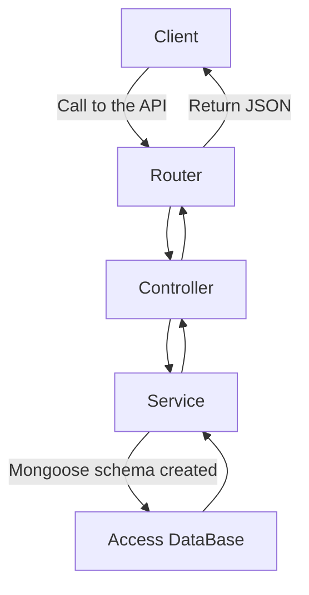

## ExpressJS and Mongoose: The Perfect Duo

Imagine having a full working API using only JavaScript for your back end, not using any SQL and having all your data stored in JSON files. Those are the possibilities when you combine [NodeJS](https://nodejs.org/en/) and [MongoDB](https://www.mongodb.com/). Using a framework like [ExpressJS](https://expressjs.com/) and an Object Data Modeling library like [Mongoose](https://mongoosejs.com/), we will see that we can do awesome things with simple and clean code. This article will not show the pros and cons of Nodejs or MongoDB but instead look at the advantages of working with the two together.


### Folder structure

So how easy could it possibly be to add a new functionality? First off, if we want to keep the code clean, we will have to divide our files properly. You can either go with a more classic approach and put all your controllers in a folder, all your models in another and all of your services in a separate one, but as you will see we took a different path for this.

We decided to separate our files by features. This means that for example if we have some user related functionalities we want to implement, we will have a ***users*** folder with its *controller*, *model*, *service* and *router*. This means anything related to users will be in the same place instead of being separated by the traditional way of joining files by logical components.

- feature1

  - feature1.controller.js
  - feature1.model.js
  - feature1.service.js
  - router.js

- feature2

  - feature2.controller.js

  - feature2.model.js

  - feature2.service.js

  - router.js

    

### Main entry point of the API

When your server starts running, there are basic configurations in the code that will run
to ensure the security of the application. In our demo the authentication used will be [JWT Web Tokens](https://jwt.io/). This little piece of code will ensure that all routers that are named **router.js** will need token authentication in order to get or post data with the API.

```javascript
// All the secure route items must be named router.js
require('./secure_routes').getSecuredRoutes().then(routes => {
  app.use('/api', jwtVerification.checkToken, routes)
});
```

In our case we made the decision that all non-secured routers will simply be named **open-router.js**. In a scenario like a login where the call actually returns you the token, we can’t
have token authentication before the login information is passed, that is the reason why we can’t say that all routes will be secured.


### Basic API call 

Let’s see how simple it can be to now to call this API. In this example we will see how for example we could add blogposts to our MongoDB database. We are going to have in our case a *blog-posts* folder that will contain all our files related to this feature. We will go through the four files one by one and explain how it works.


#### router.js

This is where we will tell our API that when this route is called, we want to call a certain function in our controller. It is as simple as specifying the route with the function like so: 

```javascript
const router = require('express').Router();

router.post('/addBlogpost', require('./blog-post.controller').postBlogPost)

module.exports = router
```


#### blog-posts.controller.js

So, in our router we said that we want to call a certain function that is declared in this controller. From here we will access the received data from the post, in our case we want to get the <u>user</u> and the <u>content</u> from de request body received from the client. Now that we have access to the data, we can call our function from the service. This is what our controller could look like with this one functionality:

```javascript
const mongoose = require('mongoose')

const BlogPostSchema = new mongoose.Schema({
    user: String,
    content: {
        title: String,
        post: String,
        date_added: Date
    }
})

module.exports = mongoose.model('Blog', BlogPostSchema)

```


#### blog-posts.service.js

Moving on to the service, this is where we will finally make our actual call to create the data in the database using the mongoose schema model. The beauty here is that there is no SQL to write, we are just going to pass our data to the function that mongoose provides us using our
model that we will define in our model file.

``` javascript
const BlogPost = require('./blog-post.model')

const createBlogPost = async (user, content) => {
  try {
    return await BlogPost.create({ user, content })
  } catch (e) {
    throw new Error(e.message)
  }
}

module.exports = {
  createBlogPost
}

```


#### blog-posts.model.js

Finally, this is where we will define what is the data we want to store in the database and put it in a mongoose schema. This is the JSON that will be generated in our collection. When we then export the module, we will tell mongoose that this model will be named *Blog* and will
contain this schema:

```javascript
const mongoose = require('mongoose')

const BlogPostSchema = new mongoose.Schema({
    user: String,
    content: {
        title: String,
        post: String
    }
})

module.exports = mongoose.model('Blog', BlogPostSchema)

```


To resume the flow of the application, we can summarize the behavior by this basic diagram: 




### Conclusion

To finish off, we can see the power of these technologies combined. We can clearly define our models with Mongoose using JSON and keep everything decoupled and tight, our services will have the job to create and use those models to add, delete or access that data and our controller will have the responsibility to call those services. Other than that, and minor configurations when creating your API, all you need to do is specify the route in your router to access that controller function. So if you are looking for a good and efficient way to have JavaScript running on your server with clean and understandable code, this is definitely one of the best way to go!